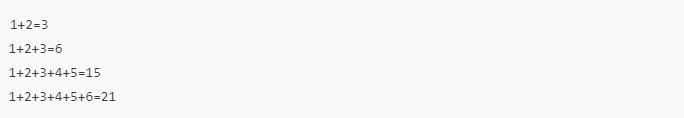

# Desafio de código: soma com varargs

O desafio refere-se a um exercício em Java onde você deve implementar uma classe chamada Add com um método que recebe um número variável de parâmetros (usando varargs) e imprime a soma desses números.

## Detalhes do Problema
- Você deve criar a classe Add e o método add de forma que ele imprima a soma dos números passados como parâmetros.
- O método add deve exibir a soma em um formato específico, incluindo os números somados e o resultado final.

## Formato de Entrada
- Seis linhas de entrada, cada uma contendo um número inteiro.

## Formato de Saída
- Quatro linhas de saída, cada uma mostrando a soma dos inteiros passados como parâmetros na chamada do método add, conforme exemplificado abaixo.

### Exemplo de Entrada

### Exemplo de Saída

